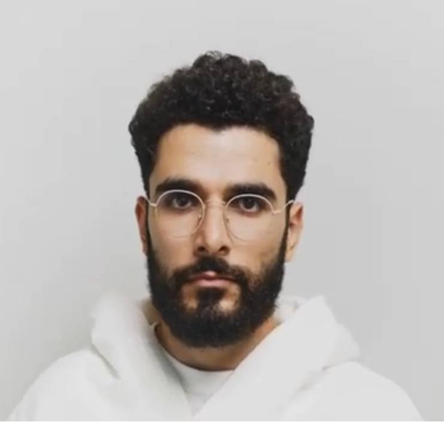

# Privacy Auto-Redaction Pipeline

Built with PipeGen (CraftifAI) — Embedded Hardware + AI Buildathon, Track A (Perception).

## What it does
Detects people in a video file and automatically blurs them, producing a privacy-safe output video. Useful for dashcam, CCTV, or interview footage that needs to be shared without revealing identities.

## Pipeline
Video file -> YOLOv8m detection (TensorRT FP16) -> custom Gaussian blur on detected regions -> blurred MP4 + detections JSON

Built entirely through PipeGen's requirement conversation, PIR review/approval, and compile/run workflow.

## Outputs
- outputs/blurred_video.mp4 - redacted output
- outputs/detections.json - per-frame detections
- input/source_video.mp4 - original source clip

## Limitations
Person-level (not face-only) redaction. Confidence threshold may miss small/distant people.
## Screenshots — Before & After

### The problem
Every day, footage that could genuinely help people — a dashcam clip proving who was at fault in an accident, CCTV footage shared with a landlord, a recorded interview being published — sits on someone's drive unused, because sharing it means exposing the identity of a bystander who never consented to being filmed. The fix is usually "get someone to manually blur every frame in Premiere," which nobody has time for, especially not for a 10-second clip that isn't worth the effort — so the footage just never gets shared at all, and useful evidence or content stays locked away.

### The fix
This pipeline removes that manual step entirely. Feed it a video, and every person in every frame gets detected and blurred automatically — no editing software, no manual masking, no frame-by-frame tracking by hand.

| Original frame | Pipeline output |
|---|---|

The detector (YOLOv8m, TensorRT-compiled at FP16) finds the person in every frame, and a custom blur stage — generated and wired in by PipeGen as part of the compiled pipeline — redacts them before the frame ever reaches the output file. What used to be a manual, frame-by-frame editing task becomes a single automated pass: point it at a video, get back a privacy-safe one.
